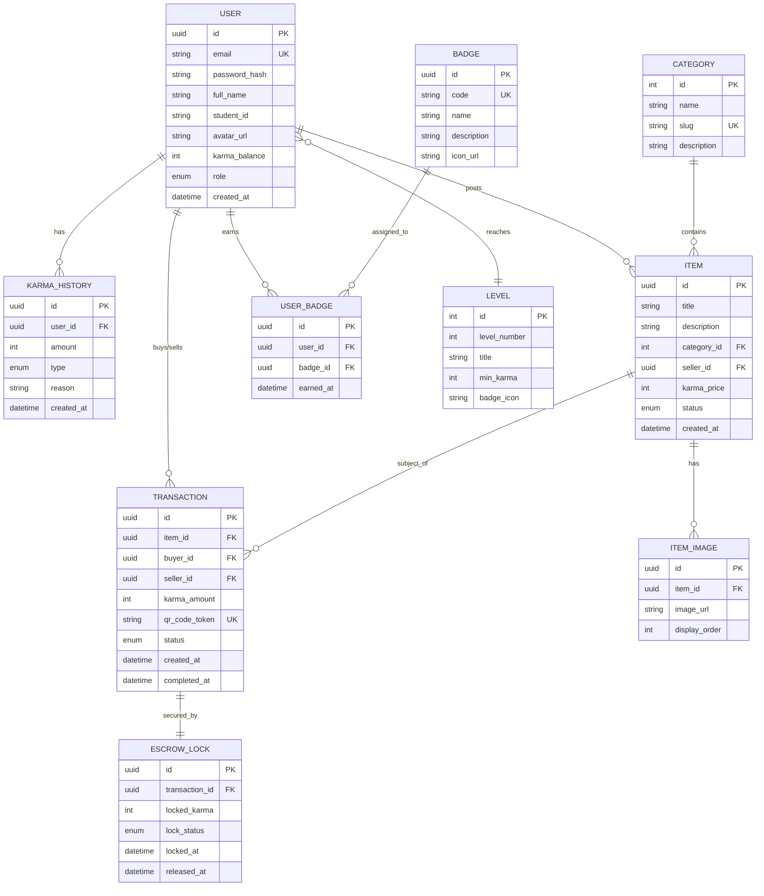
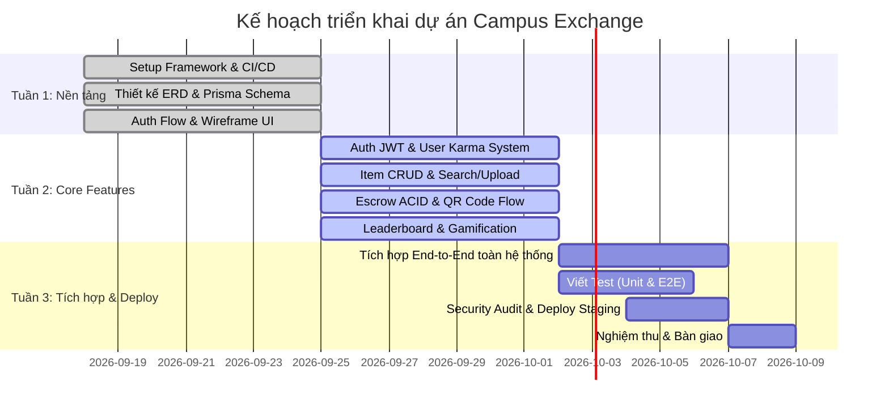

# 🎓 Campus Exchange (S2S Project)

> **Nền tảng trao đổi vật phẩm học tập & sinh hoạt sinh viên thông minh, tích hợp hệ thống điểm thưởng Karma và xác thực giao dịch an toàn qua QR Escrow.**

---

## 📌 Giới thiệu dự án

**Campus Exchange** là giải pháp số hóa việc chia sẻ, trao đổi tài liệu học tập, giáo trình, dụng cụ học tập và đồ dùng cá nhân trong khuôn viên trường đại học. Dự án giải quyết bài toán lãng phí tài nguyên, đồng thời xây dựng cộng đồng sinh viên tương trợ lẫn nhau thông qua cơ chế điểm tín nhiệm **Karma** và giao dịch an toàn tuyệt đối nhờ hệ thống giữ điểm tạm thời (**Escrow**) kết hợp quét mã **QR Code**.

Dự án áp dụng mô hình phát triển **Fullstack theo tính năng (Vertical Slice Architecture)**: mỗi thành viên chịu trách nhiệm trọn vẹn một module từ Database, API Backend (NestJS) đến Giao diện Người dùng (Next.js & shadcn/ui).

---

## 👥 Danh sách thành viên & Phân công nhiệm vụ

| STT | Thành viên | Tài khoản | Module phụ trách | Trọng tâm kỹ thuật |
| :--- | :--- | :--- | :--- | :--- |
| 1 | **Thành viên 1** | `ConQuyEngLand` | **Auth & User / Karma** | JWT Authentication (Access/Refresh Token), Role-based Access Control (RBAC), Quản lý người dùng, Hệ thống cộng/trừ điểm Karma & lịch sử giao dịch điểm. |
| 2 | **Thành viên 2** | `Huymindhack` | **Item Management** | Quản lý vòng đời vật phẩm (CRUD), Tìm kiếm & Bộ lọc nâng cao (Category, Status, Keyword), Phân trang (Pagination), Upload và tối ưu hóa hình ảnh. |
| 3 | **Thành viên 3** | `Duybua` | **Escrow & QR Verification** | Luồng giao dịch an toàn (DB Transaction đảm bảo ACID), Khóa/Mở điểm Karma (Escrow Lock), Tạo và quét mã QR xác thực thời gian thực, Rollback khi có sự cố. |
| 4 | **Thành viên 4** | `Dlow` | **Platform/Infra & Gamification** | Thiết lập hạ tầng CI/CD (GitHub Actions), Triển khai hệ thống (Deploy Vercel/Render/Neon), Bảng xếp hạng (Leaderboard), Hệ thống cấp bậc (Levels) & Huy hiệu (Badges). |

---

## 🛠 Tech Stack (Công nghệ sử dụng)

Dự án sử dụng kiến trúc phân tách rõ ràng giữa Frontend và Backend, tối ưu hóa hiệu năng, độ tin cậy và trải nghiệm lập trình viên.

### 🎨 Frontend
- **Framework:** [Next.js](https://nextjs.org/) (App Router, Server Components & Client Components)
- **Ngôn ngữ:** [TypeScript](https://www.typescriptlang.org/)
- **UI Library & Components:** [shadcn/ui](https://ui.shadcn.com/) (xây dựng trên nền [Radix UI](https://www.radix-ui.com/) và [Lucide React Icons](https://lucide.dev/))
- **Styling:** [Tailwind CSS v4](https://tailwindcss.com/)
- **Data Fetching & State:** [TanStack Query (React Query)](https://tanstack.com/query/latest) / [SWR](https://swr.vercel.app/) & [Axios](https://axios-http.com/)
- **QR Code Handling:** `html5-qrcode` / `jsQR` (cho camera scanner) và `qrcode.react` (hiển thị mã QR)
- **Form & Validation:** React Hook Form + Zod

### ⚙️ Backend
- **Framework:** [NestJS](https://nestjs.com/) (Kiến trúc Module, Controller, Service, DTO, Guard, Interceptor)
- **Ngôn ngữ:** [TypeScript](https://www.typescriptlang.org/)
- **ORM:** [Prisma ORM](https://www.prisma.io/)
- **API Documentation:** [Swagger / OpenAPI](https://swagger.io/) (`@nestjs/swagger`)
- **Authentication:** Passport.js, JWT (JSON Web Tokens), Bcrypt
- **Code Quality & Testing:** Oxlint, Prettier, Vitest, Supertest

### 🗄️ Database & Storage
- **Database:** [PostgreSQL](https://www.postgresql.org/) lưu trữ trên nền tảng Cloud [Neon Serverless Postgres](https://neon.tech/)
- **Image Storage:** Cloudinary / AWS S3 (cho lưu trữ ảnh item)

### 🚀 DevOps & Triển khai
- **VCS & Collaboration:** GitHub
- **CI/CD:** GitHub Actions (Tự động Lint, Type Check, Build và Test khi tạo PR)
- **Frontend Hosting:** [Vercel](https://vercel.com/)
- **Backend Hosting:** [Render](https://render.com/) / [Railway](https://railway.app/)
- **Database Hosting:** [Neon](https://neon.tech/)

---

## 🗄️ Tóm tắt Database & Dữ liệu (Database Architecture)

Hệ thống sử dụng **PostgreSQL** kết nối thông qua **Prisma ORM**. Toàn bộ team làm việc trên một file cấu hình duy nhất: `backend/prisma/schema.prisma`.

### 1. Sơ đồ thực thể & Mối quan hệ (ERD Overview)



### 2. Chi tiết các bảng theo Module

1. **Module Auth & User / Karma (`ConQuyEngLand`)**:
   - `users`: Thông tin định danh sinh viên, email, mật khẩu băm, số dư điểm Karma hiện tại và vai trò (`STUDENT`, `ADMIN`).
   - `karma_history`: Lịch sử biến động điểm tín nhiệm (tích lũy khi hoàn thành trao đổi, trừ điểm khi đổi vật phẩm, thưởng điểm từ hệ thống).
2. **Module Item Management (`Huymindhack`)**:
   - `categories`: Danh mục phân loại vật phẩm (Giáo trình, Tài liệu cương, Thiết bị điện tử, Đồ gia dụng ký túc xá,...).
   - `items`: Thông tin vật phẩm đăng bán/trao đổi, mức điểm Karma yêu cầu, trạng thái (`AVAILABLE`, `LOCKED`, `EXCHANGED`, `DELETED`).
   - `item_images`: Danh sách link ảnh sản phẩm hỗ trợ xem đa góc nhìn.
3. **Module Escrow & QR Verification (`Duybua`)**:
   - `transactions`: Thông tin đơn giao dịch giữa người mua và người bán, token mã hóa gắn liền với QR code.
   - `escrow_locks`: Bảng ghi nhận việc tạm khóa số điểm Karma của người mua trong suốt quá trình giao dịch. Đảm bảo tính toán **ACID Transaction** (chống double-spending hoặc tranh chấp điểm khi có lỗi mạng).
4. **Module Platform/Infra & Gamification (`Dlow`)**:
   - `levels`: Cột mốc điểm Karma tương ứng với danh hiệu (Tân sinh viên, Thành viên tích cực, Đại sứ khuôn viên,...).
   - `badges` & `user_badges`: Hệ thống huy hiệu thành tựu (Ví dụ: Giao dịch đầu tiên, Top người cho tặng, Người trao đổi uy tín 5 sao).

---

## 🌿 Quy trình làm việc với Git & GitHub (Git Workflow)

Để đảm bảo mã nguồn ổn định, tránh xung đột và nâng cao chất lượng code của cả 4 thành viên, dự án tuân thủ nghiêm ngặt quy trình sau:

### 1. Chiến lược phân nhánh (Branching Convention)
- **`main`**: Nhánh chính chứa mã nguồn đã kiểm thử và sẵn sàng triển khai. **Nghiêm cấm push trực tiếp vào `main`**.
- Nhánh tính năng tuân thủ định dạng:
  ```text
  feature/<module>-<mô-tả-ngắn>
  ```
  *Ví dụ:*
  - `feature/auth-jwt-login`
  - `feature/item-upload-cloudinary`
  - `feature/escrow-qr-scanner`
  - `feature/infra-leaderboard-ui`
- Nhánh sửa lỗi khẩn cấp:
  ```text
  fix/<tên-lỗi-cần-sửa>
  ```

### 2. Quy chuẩn Pull Request (PR) & Code Review
1. **Khởi tạo PR:** Sau khi hoàn thiện tính năng trên nhánh cá nhân, mở Pull Request trỏ vào nhánh `main`.
2. **Mô tả PR:**
   - Nêu rõ module thay đổi (Backend, Frontend hay Database).
   - Ảnh chụp màn hình / GIF minh họa giao diện (nếu là Frontend).
   - Danh sách endpoint mới kèm curl / kết quả Swagger (nếu là Backend).
3. **Điều kiện để được Merge:**
   - **Bắt buộc có ít nhất 01 review chấp thuận (Approved)** từ thành viên khác trong nhóm.
   - Toàn bộ pipeline kiểm tra tự động của **GitHub Actions CI (lint, build, test) phải PASS (màu xanh)**.
   - Giải quyết toàn bộ comment thảo luận (Resolve conversations) trước khi merge.
4. **Hình thức merge:** Ưu tiên sử dụng **Squash and merge** hoặc **Rebase and merge** để lịch sử commit trên nhánh `main` luôn gọn gàng.

### 3. Quy ước Commit Message (Conventional Commits)
Thông điệp commit phải ngắn gọn, súc tích và tuân thủ định dạng:
```text
<type>(<scope>): <mô tả ngắn gọn bằng tiếng Anh hoặc tiếng Việt>
```
- `feat`: Thêm tính năng mới (VD: `feat(auth): add refresh token mechanism`).
- `fix`: Sửa lỗi (VD: `fix(item): fix pagination offset bug`).
- `docs`: Cập nhật tài liệu, README (VD: `docs: update git workflow guidelines`).
- `style`: Định dạng code, format, không ảnh hưởng logic (VD: `style(frontend): format with prettier`).
- `refactor`: Tái cấu trúc mã nguồn (VD: `refactor(escrow): optimize db transaction logic`).
- `test`: Viết thêm unit test hoặc e2e test (VD: `test(auth): add test cases for register service`).
- `chore`: Cập nhật cấu hình, build tool, dependencies (VD: `chore: add shadcn button component`).

### 4. Quy tắc an toàn khi làm việc với Prisma Schema
Vì 4 thành viên cùng cập nhật file `backend/prisma/schema.prisma`:
1. Trước khi tạo migration mới, luôn pull nhánh `main` mới nhất về máy:
   ```bash
   git checkout main
   git pull origin main
   git checkout feature/<tên-nhánh>
   git merge main
   ```
2. Thêm model hoặc trường dữ liệu của module mình phụ trách.
3. Chạy lệnh migrate cẩn thận:
   ```bash
   npx prisma migrate dev --name <ten_migration_ngan_gon>
   ```
4. Thống nhất giờ merge PR có thay đổi database để tránh migration conflict giữa các thành viên.

---

## 💻 Hướng dẫn Cài đặt & Chạy cục bộ (Getting Started)

### Yêu cầu môi trường
- [Node.js](https://nodejs.org/) version `>= 20.x`
- [npm](https://www.npmjs.com/) hoặc `pnpm`
- Tài khoản [Neon](https://neon.tech/) (hoặc Postgres chạy cục bộ)

---

### 1. Cài đặt & Khởi chạy Backend (NestJS)

```bash
# 1. Điều hướng vào thư mục backend
cd backend

# 2. Cài đặt các thư viện phụ thuộc
npm install

# 3. Tạo file cấu hình môi trường .env
cp .env.example .env
```

Cấu hình file `.env` mẫu:
```env
PORT=3000
DATABASE_URL="postgresql://<user>:<password>@<neon-host>/<db_name>?sslmode=require"
JWT_SECRET="your_super_secret_jwt_key_here"
JWT_EXPIRATION="1d"
JWT_REFRESH_SECRET="your_super_secret_refresh_key_here"
JWT_REFRESH_EXPIRATION="7d"
CLOUDINARY_CLOUD_NAME="your_cloud_name"
CLOUDINARY_API_KEY="your_api_key"
CLOUDINARY_API_SECRET="your_api_secret"
```

```bash
# 4. Đồng bộ cơ sở dữ liệu với Prisma
npx prisma generate
npx prisma migrate dev

# 5. Chạy backend ở chế độ phát triển
npm run start:dev
```
- API chạy tại: `http://localhost:3000`
- Tài liệu API (Swagger UI): `http://localhost:3000/api`

---

### 2. Cài đặt & Khởi chạy Frontend (Next.js + shadcn/ui)

```bash
# 1. Điều hướng vào thư mục frontend
cd frontend

# 2. Cài đặt các thư viện phụ thuộc
npm install

# 3. Tạo file cấu hình môi trường .env.local
cp .env.example .env.local
```

Cấu hình file `.env.local`:
```env
NEXT_PUBLIC_API_URL=http://localhost:3000
```

#### Hướng dẫn cài đặt thêm component từ **shadcn/ui**:
Dự án sử dụng bộ component chất lượng cao của **shadcn/ui**. Khi cần sử dụng component mới, chạy lệnh:
```bash
# Cài đặt button, dialog, dropdown, input, card, v.v.
npx shadcn@latest add button card dialog input dropdown-menu avatar badge toast
```

```bash
# 4. Khởi chạy server phát triển
npm run dev
```
- Giao diện chạy tại: `http://localhost:3001` (hoặc `http://localhost:3000` tùy cấu hình port)

---

## 📅 Lộ trình thực hiện (Timeline 3 tuần)



| Tuần | Mục tiêu chính | Lưu ý phối hợp giữa các thành viên |
| :--- | :--- | :--- |
| **Tuần 1: Nền tảng** | Khởi tạo cấu trúc NestJS & Next.js, cấu hình Prisma, thiết kế ERD chuẩn, tạo layout chung và các form cơ bản. | Họp thống nhất ERD, API contracts và phân chia routing trước khi viết code nghiệp vụ. |
| **Tuần 2: Chức năng chính** | Hoàn thành API và UI của từng module cá nhân: Auth/Karma, Item CRUD/Filter, Escrow Lock & QR Scanner, Gamification/Badges. | Bắt đầu tích hợp chéo (VD: Module Item & Escrow cần Token Auth của TV1 để xác thực). |
| **Tuần 3: Hoàn thiện & Triển khai** | Tích hợp liên kết End-to-End, viết unit test/e2e test, rà soát bảo mật (CORS, Rate Limit), deploy production. | Test toàn bộ chu trình: Đăng ký $\rightarrow$ Đăng item $\rightarrow$ Khóa Karma $\rightarrow$ Quét mã QR $\rightarrow$ Nhận điểm & mở khóa huy hiệu. |

---

## ⚠️ Lưu ý quan trọng & Quản trị rủi ro

1. **Thành viên 1 (`ConQuyEngLand`)**: Cần hoàn thành sớm luồng Auth & cấp JWT Token để các thành viên khác có thể gắn token vào header khi test API của module Item và Escrow.
2. **Thành viên 3 (`Duybua`)**: Module Escrow liên quan trực tiếp đến số dư Karma, bắt buộc phải sử dụng **Prisma Transaction (`prisma.$transaction`)** để đảm bảo tính toàn vẹn (ACID), phòng tránh race-condition khi người dùng mở nhiều tab hoặc quét mã đồng thời.
3. **Tránh Conflict Migration**: Thống nhất giờ merge file `schema.prisma`. Khi có xung đột migration, không tự ý xóa migration cũ trên production database.

---

## 📄 Bản quyền & Đóng góp
Dự án được xây dựng và duy trì bởi nhóm sinh viên dự án **Campus Exchange (S2S Project)**. Mọi đóng góp xin vui lòng gửi qua Pull Request theo đúng quy trình đã cam kết.
